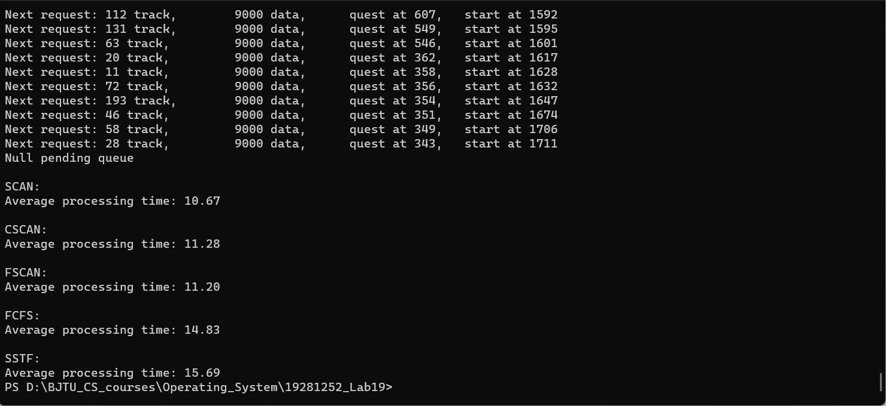

# 移动头磁盘调度算法模拟实现与比较

## 1. Enviornment

### 1.1 开发环境
Compiler: Windows-mingw32-make or Linux-make
Editor: vscode

### 1.2 运行环境
Windows or Linux(Ubuntu 20.04)

### 1.3 工程构成
Work directory:
|-- magnetic_track.h
    magnetic_track.c
    track_schedule.h
    track_schedule.c
    tq_gen.h
    tq_gen.c
    main.c
    Makefile
Makefile:
```Makefile
objects = main.o tq_gen.o track_schedule.o magnetic_track.o

main: $(objects)
	cc -o main $(objects)

main.o : main.c track_schedule.o magnetic_track.o tq_gen.o
	cc -c -g main.c

track_schedule.o: track_schedule.c magnetic_track.h
	cc -c -g track_schedule.c

magnetic_track.o: magnetic_track.c 
	cc -c -g magnetic_track.c

tq_gen.o: tq_gen.c magnetic_track.h
	cc -c -g tq_gen.c

clean :
	del main.exe $(objects)
```

## 2. 模拟磁盘请求生成和磁盘请求调度
磁盘寻道请求由程序按时间顺序生成。程序根据当前运行的时间和当前生成的磁盘寻道请求根据调度算法选择下次处理的寻到请求。

### 2.1 请求结构体 struct track_quest

```c
struct track_quest {
    int track_id;
    int reqdata;
    int vreqtime;
    struct track_quest* nt_qt;
    struct track_quest* pr_qt;
};
```

整个请求序列由双向链表构建。每个请求应当具有的属性为：磁道号（track_id），请求读写数据量（reqdata），请求时间（vreqtime）。

### 2.2 请求序列 struct track_quest_queue 和请求序列生成

```c
struct track_quest_queue {
    int total_quest;
    struct track_quest* tq_st;
    struct track_quest* tq_fs;
    struct track_quest* tq_cr;
};
```

这个队列结构体指示了按时间顺序生成的请求序列的基本属性：序列头指针（tq_st），序列尾指针（tq_cr），和扫描指针（tq_fs）

#### 2.2.1 请求序列的附加（append）操作

代码：**magnetic_track.c**

```c
void m_track_queue_update(struct track_quest_queue* tq_hd, int track_id, int reqdata, int vreqtime) {
    tq_hd->tq_cr->reqdata = reqdata;
    tq_hd->tq_cr->vreqtime = vreqtime;
    tq_hd->tq_cr->track_id = track_id;

    struct track_quest* p = tq_hd->tq_cr;
    p->nt_qt = (struct track_quest*)malloc(sizeof(struct track_quest));
    p->nt_qt->pr_qt = p;
    tq_hd->tq_cr = p->nt_qt;
    tq_hd->tq_cr->nt_qt = NULL;
}
```

将一组新的属性转化为队列节点插入队列之中。

#### 2.2.2 新请求的生成操作（生成一组新的属性）

代码：**tq_gen.c**

生成新的随机磁道号：

```c
int gen_quest_track() {
    return rand() % MAX_TRACK;
}
```

生成新的请求时间：

```c
int gen_quest_time() {
    static int s;
    int gen_time = rand() % QUEST_TIME_FIELD + s;
    s = gen_time + 1;

    float x = (float)(rand() % 1000) / 1000.0;
    if (x < 0.2)
        s += GAP;
    return gen_time;
}
```

设定一个基础时间s，每次请求的时间都会在[s, s+7]的范围内生成。当生成新的时间gen_time时，更新s使其为gen_time + 1以保证没有同时的生成时间。并且每次生成时间之后设定一个概率，使磁盘有一定概率进入一个请求空闲阶段。

### 2.3 实时调度逻辑与待调度请求序列 struct pending_queue

代码：**magnetic_track.h**

```c
struct pending_queue {
    int vruntime;
    int track_loc;
    int momentum;
    struct track_quest* tq_processing;
    struct track_quest* pq_cr;
    struct track_quest* assist;
};
```

该结构体指示了一个待调度请求队列。其具有如下几个属性：运行时间（vruntime）、当前磁盘磁头位置（track_loc）、当前磁头运行方向（momentum）、待调度请求队列头节点（tq_processing）与尾节点（pq_cr）、与一个辅助指针（assist）

#### 2.3.1 实时调度逻辑

通过比较待调度请求队列的运行时间和请求队列的节点请求时间即可判定该节点是否可以等待调度。

代码：**magnetic_track.c**

```c
struct track_quest* m_track_queue_select(struct track_quest_queue* tq_hd, struct pending_queue* pq_hd) {
    struct track_quest* res_tq;

    if (pq_hd->tq_processing == pq_hd->pq_cr) {
        // pq_hd队列为空
        if (tq_hd->tq_fs == tq_hd->tq_cr) {
            // tq_hd扫描节点tq_fs已经到达尾节点
            return NULL;
        }
        res_tq = tq_hd->tq_fs;
        tq_hd->tq_fs = tq_hd->tq_fs->nt_qt;
        // tq_hd->tq_st->pr_qt = NULL;

        if (pq_hd->vruntime <= res_tq->vreqtime)
            // 如果待调度队列当前的运行时间小于该分配请求的请求时间
            pq_hd->vruntime = res_tq->vreqtime;
        	// 将运行时间运行至该请求的请求时间

        return res_tq;
    }
    else {
        if (tq_hd->tq_fs == tq_hd->tq_cr)
            return NULL;
        if (tq_hd->tq_fs->vreqtime <= pq_hd->vruntime) {
            // 如果当前磁盘请求的请求时间小于运行时间
            res_tq = tq_hd->tq_fs;
            tq_hd->tq_fs = tq_hd->tq_fs->nt_qt;

            return res_tq;
        }
        else
            return NULL;
    }
}
```

这样通过语句`while((tq = m_track_queue_select(tq_hd, pq_hd)) != NULL)` 就可以遍历出当前运行时间下的待调度队列。

#### 2.3.2 请求处理逻辑

代码：**track_schedule.c**

```c
int track_sche_process(struct pending_queue* pq_hd) {
    static int total_process_time;
    struct track_quest* p = pq_hd->tq_processing;
    if (p->nt_qt == NULL) {
        printf("Null pending queue\n");
        return 0;
    }
    printf("Next request: %d track, \t%d data, \tquest at %d, \tstart at %d\n",
        p->track_id, p->reqdata, p->vreqtime, pq_hd->vruntime);

    // printf("Processing...\n");

    int time_used = m_track_quest_time(p, pq_hd->track_loc);
    pq_hd->vruntime += time_used;
    total_process_time += time_used;
    pq_hd->track_loc = p->track_id;
    pq_hd->tq_processing = p->nt_qt;
    pq_hd->tq_processing->pr_qt = NULL;

    // printf("End processing, time used %d, \tcurrent disk head %d, \truntime %d\n\n", time_used, pq_hd->track_loc, pq_hd->vruntime);
    return total_process_time;
}
```

检查待调度队列，将头节点处理掉，并根据其磁道号，请求数据量，计算其处理时间，并更新待调度队列的当前时间。如果当前调度队列为空队列，则返回0。否则返回当前处理时间之和。

## 3. 调度算法的实现

根据上面的基础信息，完成一个调度的执行顺序应该是：

```c
while ((mq = m_track_queue_select(tq_hd, pq_hd)) != NULL) {
        tq = (track_quest*)malloc(sizeof(track_quest));
        tq->reqdata = mq->reqdata;
        tq->track_id = mq->track_id;
        tq->vreqtime = mq->vreqtime;
        /* Disk schedule code segment */
    }
/* Disk schedule code segment */
    track_sche_process(pq_hd);
```

在Disk schedule code segment中完成调度操作，即对等待队列进行不断的更新操作，使得下一个被调度的请求永远维护在待调度队列的首位（tq_processing）

### 3.1 FCFS调度算法

按时间顺序向pending_queue的尾部添加即可。

代码：**track_schedule.c**

```c
int track_schedule_FCFS(struct pending_queue* pq_hd, struct track_quest_queue* tq_hd) {
    struct track_quest* p = pq_hd->pq_cr;
    struct track_quest* tq;
    struct track_quest* mq;

    // update the pending queue by FCFS
    while ((mq = m_track_queue_select(tq_hd, pq_hd)) != NULL) {
        tq = (track_quest*)malloc(sizeof(track_quest));
        tq->reqdata = mq->reqdata;
        tq->track_id = mq->track_id;
        tq->vreqtime = mq->vreqtime;
        tq->pr_qt = p->pr_qt;
        tq->nt_qt = p;

        if (p->pr_qt == NULL)
            pq_hd->tq_processing = tq;
        else
            p->pr_qt->nt_qt = tq;
        p->pr_qt = tq;
    }

    return track_sche_process(pq_hd);
}
```

此后代码不体现在报告中，请根据信息去源代码文件中查看。

### 3.2 SSTF调度算法

代码：**track_schedule.c L63**

先按照FCFS调度算法将pending_queue更新完成，而后在其中遍历磁道号与磁头位置最近的，并将其替换至头节点位置。而后调用track_sche_process函数进行处理。

### 3.3 SCAN与CSCAN调度算法

代码：**track_schedule.c L116**

SCAN算法将用到pending_queue::assist属性。assist指针将指向下一次扫描的头节点。例如符合SCAN调度的队列35，80，149，189，20，8。assist指针将指向20的位置。即[tq_processing, assist)是符合当前磁头移动方向的调度队列，而[assist, pq_cr]则是反向移动的调度队列。通过当前磁头的位置，确定节点（tq）是要加入符合当前磁头移动方向的队列（tq->track_id > pq_hd->track_loc），还是加入与磁头移动方向相反的队列（tq->track_id <= pq_hd->track_loc）。确定节点属于哪一类队列后，如果是与当前磁头方向相同则遍历该队列，找到符合(tq->track_id - p->track_id) * pq_hd->momentum > 0的p节点位置，并将待调度节点tq插入。反之如果确定要加入与当前磁头方向相反的队列，则将条件改变为(tq->track_id - p->track_id) * pq_hd->momentum <= 0即可。最后，每次调度完成[tq_processing, assist)的队列（tq_processing == assist），则修改磁头的移动方向。

FSCAN算法与SCAN算法基本一致。只不过不会修改磁头的移动方向。因此只需要对SCAN算法添加一个变量{-1, 1}，-1则代表会修改磁头移动方向，1则不会修改磁头移动方向。简单修改即可。具体见代码。

### 3.4 FSCAN调度算法

代码：**track_schedule.c L180**

FSCAN调度算法基本调度策略与SCAN一致。只不过不完成当前的待调度队列是不会接受新的调度请求的，因此只需要在调度循环`while ((mq = m_track_queue_select(tq_hd, pq_hd)) != NULL)`前设置一个if条件，使得该语句块不能在(pending_queue->tq_processing != pending_queue->pq_cr)的情况下运行即可。具体见代码。

## 4. 调度算法的性能比较



可以看到相对来说SCAN，CSCAN，FSCAN的性能无甚区别。而FCFS和SSTF算法也区别不大。前后差距则比较明显。